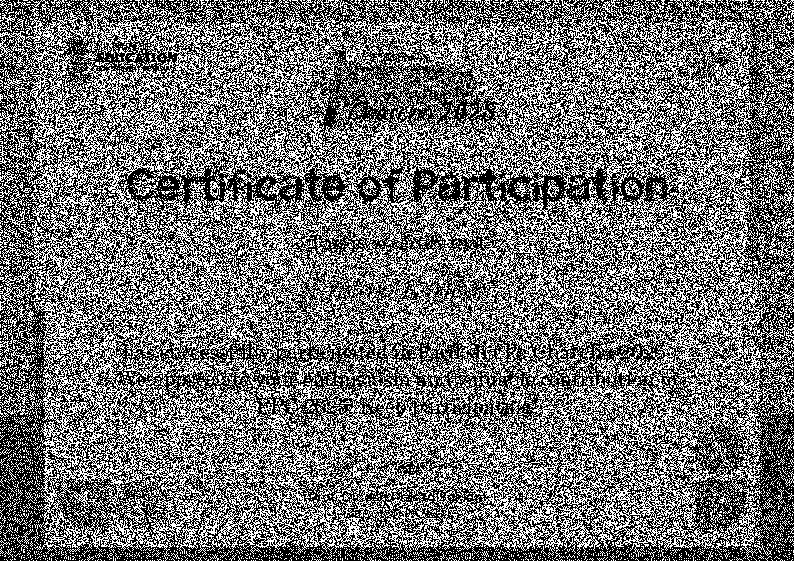

# Pixel-Level Visual Cryptography Engine (2,2 Scheme)

A complete Python implementation of Naor and Shamir's Visual Secret Sharing Scheme. This engine maps an $N \times M$ binary secret image into two individual matrix shares of size $2N \times 2M$. Individually, each share exhibits perfect information entropy (0% data leak). Stacking the shares via software-simulated transparency alignment fully reconstructs the hidden source.

## 🧪 Computational Milestones Achieved
- **Perfect Secrecy Security:** Verified mathematically using random bitwise coin-toss distributions. Individual shares reveal absolute high-frequency static noise.
- **Adaptive Contrast Thresholding:** Overcame the inherent 50% contrast degradation of digital pixel blending by engineering an post-processing intensity filter.
- **Fault-Tolerant File Execution:** Fully optimized code execution pathways for image matrix mode manipulation (`1` and `L` transitions).

## 📊 Visual Verification

| Encrypted Share 1 | Encrypted Share 2 | Decrypted & Enhanced Outpu |
| :---: | :---: | :---: |
|  |  | 

## 🚀 Execution Steps
1. Drop any binary or color image in the directory as `secret.png`.
2. Run `python visual_crypto.py`.
3. The engine dynamically spawns both noisy key shares and outputs the high-contrast reconstructed secret.
